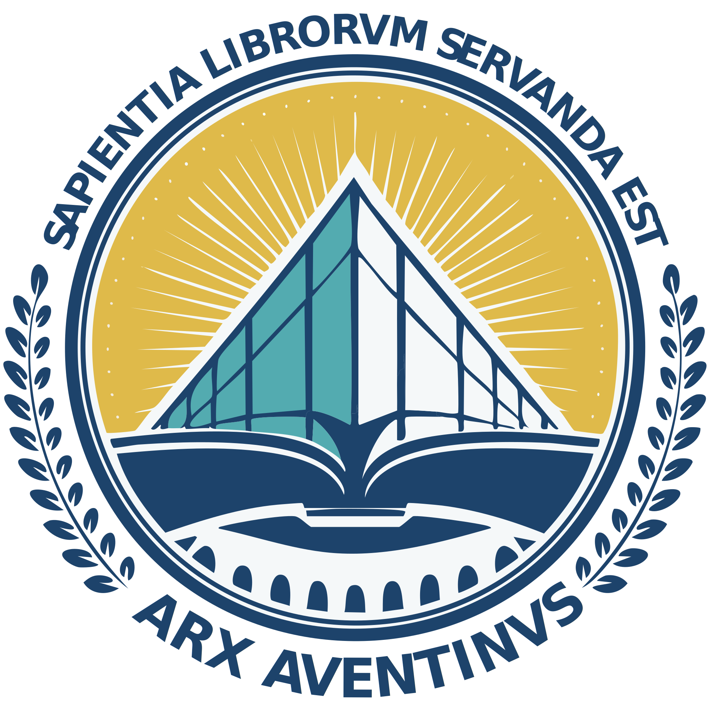

# ARX ARVENTINUS

<div style="text-align: center;">
    
    <p style="font-size: 22px; font-family: serif;">
        THE AVENTINE SOFTWARE
    </p>
</div>

## Installation

First ensure that you have an isolated Python environment set up (we encourage using [mamba](https://mamba.readthedocs.io/en/latest/) to manage environments). Aventine has been tested to work with Python 3.11.11.

1. First run the following to clone and install Aventine:
    ```bash
    git clone https://PerceptronV/aventine
    cd aventine
    pip install -e .
    ```

2. Run the onboarding script to use pre-indexed data provided by the authors of Aventine. It is IMPORTANT that you run this command in the root directory of the repository; i.e. where you installed Aventine from.
    ```bash
    aventine-download
    ```

3. Extract the [relevant binaries](./aventine/tools/dist/) of Whitaker's Words for your operating system into [`aventine/tools/bin`](./aventine/tools/bin/).

## Deployment

### Development

Run the following to spin up a debug server:
```
flask --app aventine run --debug
```

### Production

## Credits

The Latin texts used in generating the indexed data (i.e. the files that `aventine-download` downloads) were derived from sources in [Perseus Digital Library](https://www.perseus.tufts.edu/hopper/). Credit goes to the Perseus Digital Library in providing these texts; all indexed data is therefore licensed under a [Creative Commons Attribution-ShareAlike 3.0 United States License](https://creativecommons.org/licenses/by-sa/3.0/us/).

[David Sanson](https://github.com/dsanson)'s binaries of [William Whitaker's WORDS]() were used to provide English meanings for the Latin lemmata. Read the [README](./aventine/tools/dist/README.md) in [tools/dist](./aventine/tools/dist/) for further licensing and related information.

Aventine depends heavily on:
- [Flask](https://flask.palletsprojects.com/en/stable/) and [Waitress](https://docs.pylonsproject.org/projects/waitress/en/latest/) for the web framework.
- [The Classical Language Toolkit (cltk)](http://cltk.org/) for Latin lemmatisation and many other miscellaneous processing tasks.
- [SentenceTransformers](https://sbert.net/) and in particular, the '[Alibaba-NLP/gte-base-en-v1.5](https://huggingface.co/Alibaba-NLP/gte-base-en-v1.5)' model, for vectorising English sentences.
- [Gensim](https://radimrehurek.com/gensim/) for word2vec vector training.
- [BeautifulSoup4](https://www.crummy.com/software/BeautifulSoup/bs4/doc/) and [lxml](https://lxml.de/) for scraping data.

In particular, here are the `BIBTEX` citations for research / engineering endeavours related to natural language processing in Latin that were involved in Aventine.
```bibtex
% Word2Vec
@article{mikolov2013efficient,
    title={Efficient estimation of word representations in vector space},
    author={Mikolov, Tomas and Chen, Kai and Corrado, Greg and Dean, Jeffrey},
    journal={arXiv preprint arXiv:1301.3781},
    year={2013}
}
% Word2Vec embeddings for Latin
@inproceedings{fares-etal-2017-word,
    title = "Word vectors, reuse, and replicability: Towards a community repository of large-text resources",
    author = "Fares, Murhaf  and
      Kutuzov, Andrey  and
      Oepen, Stephan  and
      Velldal, Erik",
    editor = {Tiedemann, J{\"o}rg  and
      Tahmasebi, Nina},
    booktitle = "Proceedings of the 21st Nordic Conference on Computational Linguistics",
    month = may,
    year = "2017",
    address = "Gothenburg, Sweden",
    publisher = "Association for Computational Linguistics",
    url = "https://aclanthology.org/W17-0237",
    pages = "271--276",
}
% Stanford Stanza system for pre-processing Latin
@article{qi2020stanza,
    title={Stanza: A Python natural language processing toolkit for many human languages},
    author={Qi, Peng and Zhang, Yuhao and Zhang, Yuhui and Bolton, Jason and Manning, Christopher D},
    journal={arXiv preprint arXiv:2003.07082},
    year={2020}
}
% CLTK
@Misc{johnsonetal2014cltk,
    author = {Johnson, Kyle P. and Patrick Burns and John Stewart and Todd Cook},
    title = {CLTK: The Classical Language Toolkit},
    url = {https://github.com/cltk/cltk},
    year = {2014--2021},
}
```

## License

All of my code are licensed under the GNU General Public License 3.0 (except for tool binaries in [tools/dist](./aventine/tools/dist); see the [README](./aventine/tools/dist/README.md) in that directory for attribution).

```
Aventine: Vector search for classical Latin texts.
Copyright (C) 2024  Yiding Song

This program is free software: you can redistribute it and/or modify
it under the terms of the GNU General Public License as published by
the Free Software Foundation, either version 3 of the License, or
(at your option) any later version.

This program is distributed in the hope that it will be useful,
but WITHOUT ANY WARRANTY; without even the implied warranty of
MERCHANTABILITY or FITNESS FOR A PARTICULAR PURPOSE.  See the
GNU General Public License for more details.

You should have received a copy of the GNU General Public License
along with this program.  If not, see <https://www.gnu.org/licenses/>.
```
